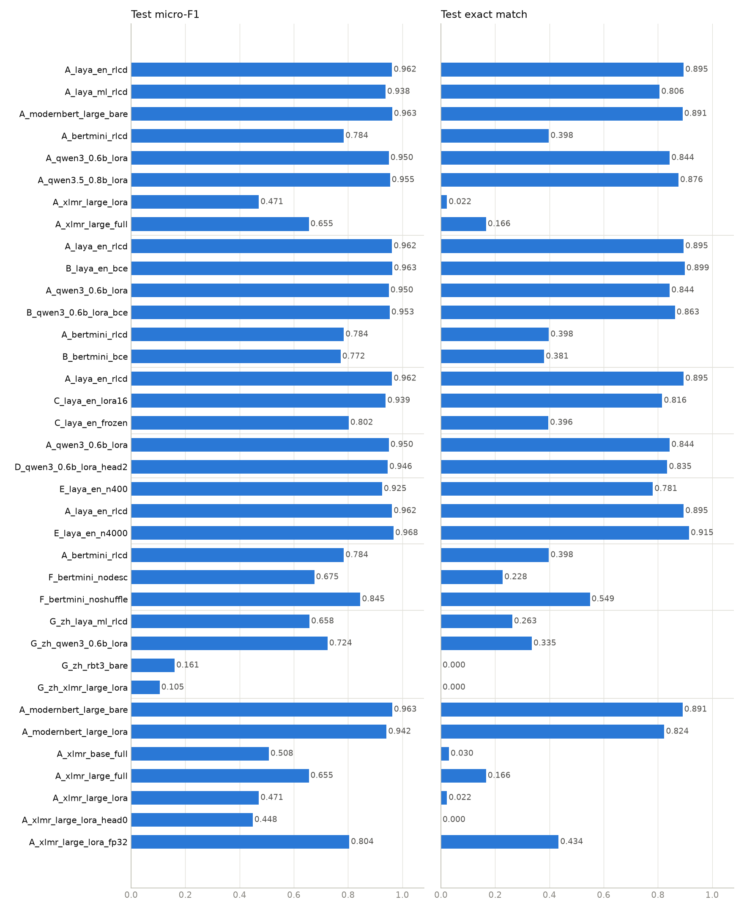
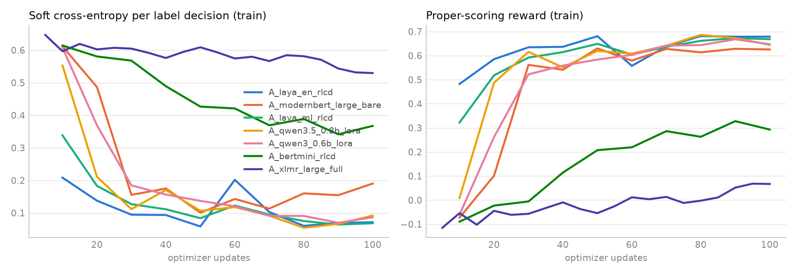

# 多标签意图分类：消融实验报告

日期：2026-09-23 ｜ 机器：Apple M4，16 GB 统一内存，MPS ｜ 软件：torch 2.14.0、transformers 5.17.0、peft 0.21.0、trackio 0.38.1
｜ 代码：`laya/multilabel`（PR #1、#2）｜ 所有 run 记录在 trackio 项目 **`laya-multilabel-ablation`**（`trackio show --project laya-multilabel-ablation`）

## 摘要

- 在同一预算（MixSNIPS 1,600 条、1 epoch、100 次更新）下，**Laya 英文 checkpoint 全参微调（test micro-F1 0.962）与裸 ModernBERT-large（0.963）打平**；
  Qwen3.5-0.8B LoRA 0.955、Qwen3-0.6B LoRA 0.950 紧随其后，只训 1.5–2% 的参数、内存不到全参微调的三分之一。
- **RLCD 与纯 BCE 在三个基模上都打平**（差异 ≤ 0.012，单 seed 噪声内），RL 项的额外计算量可以忽略，但也没有带来精度收益。
- **标签描述是最便宜也最有效的杠杆**：BERT-mini 去掉描述后 test F1 从 0.784 掉到 0.676。
- 全参 > LoRA（−0.023）≫ 冻结主干只训头（−0.16）；decoder 上的 2 层随机决策头没有收益。
- 数据量 400 → 1,600 → 4,000：micro-F1 0.926 → 0.962 → 0.968，exact match 0.78 → 0.90 → 0.92，边际收益递减但 exact match 仍在涨。
- 中文 60 意图（MASSIVE zh 合成）在同样预算下还远未收敛，见 G 节。
- **xlm-roberta-large 在同一预算下不可比**（LoRA 0.471 / 全参 0.655）：bf16 主干权重对它有害（fp32 LoRA 0.804），而且起步远慢于 ModernBERT；同样的 LoRA + 随机决策头配方在 ModernBERT-large 上是 0.942（H 节）。
- Gemma 4 E2B 在这台机器上的尝试见第 4 节。

## 1. 实验协议

| 项 | 设置 |
|---|---|
| 主数据集 | MixSNIPS（7 个意图，每句 1–3 个）。训练取前 **1,600** 条（占训练集 4%），dev 取前 500 条用于选模与校准，**test 用完整 2,199 条** |
| 中文数据集 | MASSIVE zh-CN 合成多意图（60 个意图，每句 1–3 个）。训练 1,600 条，dev 300，test 600 |
| 预算 | **1 epoch = 200 个 micro-batch（8）× 梯度累积 2 = 100 次更新**，全部变体相同（中文变体 micro-batch 4 × 累积 4，同样 100 次更新） |
| 优化 | AdamW，cosine 到 1e-6，clip 1.0；Laya / ModernBERT：encoder 2.5e-5、head 1e-4；LoRA：adapter 2e-4、head 1e-4；小模型（BERT-mini、rbt3）：1e-4 / 5e-4 + 5% warmup |
| RLCD | G=4，σ 0.4 → 0.1，w_sph 0.75，`rl_weight` 1、`ce_weight` 1；BCE 变体 `rl_weight` 0 |
| LoRA | r=16，α=32，dropout 0.05，打全部线性层，主干 bf16 冻结；只存 adapter |
| 校准 | 在 dev 上拟合一个温度（LBFGS）+ 搜索一个全局阈值（最大化 micro-F1），再评 test |
| 指标 | micro/macro-F1、exact match（整个意图集合完全正确）、ECE（逐标签判定）、Brier；参数量、可训练参数、峰值内存、训练分钟数、推理 ms/条 |
| 随机性 | 单 seed（42）。test 有 2,199 条 × 约 2 个标签 ≈ 4,400 个判定，**micro-F1 差异 < 0.01、exact match 差异 < 0.02 视为噪声** |
| 记录 | trackio（本地 SQLite）：每 20 步的 loss/rl/ce/reward/σ/lr、每 epoch 的 dev 指标、最终 dev/test 指标、run 统计；每个 run 目录下另有 `train_log.jsonl`、`metrics.json`、`train.log` |

说明：
- "峰值内存"在 MPS 上是按步采样的 `driver_allocated_memory`，是下界；encoder 全参微调的 10–13 GB 主要是 fp32 权重 + AdamW 状态（421M × 16 字节 ≈ 6.7 GB）加激活和分配器缓存。
- 推理延迟在 MPS 上测，batch 1 的数字抖动大（±30%），只看量级。
- `A_laya_en_rlcd` 是在修掉 MPS 分配器缓存增长问题之前跑的（训练中一度进入换页），它的 14.0 分钟和 13.5 GB 偏高；同配置的 `B_laya_en_bce` 在修复后跑，10.3 分钟 / 11.6 GB 更能代表真实成本。

## 2. 变体清单

`grid.ablation.json`，基础配置 `config.ablation.json`。七个轴：

| 轴 | 变体 |
|---|---|
| A 基模 | Laya 英文 ckpt、Laya multilingual ckpt、裸 ModernBERT-large、BERT-mini、Qwen3-0.6B LoRA、Qwen3.5-0.8B LoRA、xlm-roberta-large（LoRA / 全参）、（Gemma 4 E2B LoRA） |
| B 目标函数 | RLCD vs 纯 BCE，在 Laya-en / Qwen3 / BERT-mini 上 |
| C 训练方式 | 全参 vs LoRA r=16 vs 冻结主干，Laya-en |
| D 决策头 | 0 层 vs 2 层，Qwen3 LoRA |
| E 数据量 | 400 / 1,600 / 4,000 条，Laya-en |
| F 问题构造 | 有无标签描述、是否打乱标签顺序，BERT-mini |
| G 中文 | Laya-ml、Qwen3-0.6B LoRA、hfl/rbt3、xlm-roberta-large LoRA，MASSIVE zh 60 意图 |
| H 诊断 | xlm-roberta-large：LoRA bf16 / fp32 / 0 层头 / 全参，xlm-roberta-base 全参，ModernBERT-large LoRA |

## 3. 结果

### A. 基模（MixSNIPS，同一预算）

| variant | lora | params (M) | trainable (M) | dev F1 | test F1 | test macro-F1 | exact | ECE | train min | peak GB | ms/ex (batched) |
|---|---|---|---|---|---|---|---|---|---|---|---|
| A_laya_en_rlcd | 0 | 421 | 421.3 | 0.9795 | 0.9619 | 0.9617 | 0.8950 | 0.0095 | 14.0 | 13.5 | 56.2 |
| A_laya_ml_rlcd | 0 | 322 | 321.9 | 0.9622 | 0.9381 | 0.9376 | 0.8063 | 0.0146 | 4.6 | 9.6 | 22.2 |
| A_modernbert_large_bare | 0 | 421 | 421.3 | 0.9753 | 0.9628 | 0.9629 | 0.8909 | 0.0078 | 10.4 | 10.6 | 59.8 |
| A_bertmini_rlcd | 0 | 13 | 12.9 | 0.8326 | 0.7842 | 0.7783 | 0.3979 | 0.0330 | 0.3 | 1.5 | 1.5 |
| A_qwen3_0.6b_lora | 16 | 608 | 11.4 | 0.9613 | 0.9501 | 0.9498 | 0.8436 | 0.0130 | 15.4 | 2.5 | 102.7 |
| A_qwen3.5_0.8b_lora | 16 | 764 | 12.1 | 0.9730 | 0.9548 | 0.9543 | 0.8759 | 0.0125 | 32.2 | 3.7 | 270.8 |
| A_xlmr_large_lora | 16 | 594 | 33.6 | 0.4605 | 0.4709 | 0.4610 | 0.0223 | 0.0942 | 8.2 | 4.2 | 53.2 |
| A_xlmr_large_full | 0 | 586 | 586.4 | 0.6430 | 0.6552 | 0.6610 | 0.1664 | 0.1579 | 19.1 | 14.3 | 47.4 |






- **Laya 英文 checkpoint（0.962）与裸 ModernBERT-large（0.963）打平**，exact match 也几乎相同（0.895 vs 0.891）。RLCD 预训练的决策头在这个预算下没有带来最终分数的优势——它的价值体现在收敛速度上：训练曲线里 Laya-en 在第 20 步的软交叉熵是 0.21，裸 ModernBERT 是 0.61，到第 100 步两者才汇合（零样本时更明显：Laya-en dev 0.71，裸模型是随机）。
- **两个 decoder 只训 1.5–2% 的参数就到了 0.950 / 0.955**，峰值内存 2.5 / 3.7 GB，是 encoder 全参微调的 1/4；代价是推理慢：Qwen3 每条 103 ms、Qwen3.5 271 ms（线性注意力在 MPS 上走 torch 慢路径），encoder 类 56–60 ms，Laya-ml 22 ms。
- **Qwen3.5-0.8B > Qwen3-0.6B**（+0.005 F1、+0.03 exact），dev 上差距更大（0.973 vs 0.961）。
- Laya multilingual（mmBERT-base）在英文上落后英文 checkpoint 2.4 个点，但最小最快，且是中文任务的候选。
- BERT-mini（11M）0.784：模型容量是硬上限。
- **xlm-roberta-large 在这个预算下没有进入状态**：LoRA（bf16）0.471、全参 0.655，都远低于同尺寸的 ModernBERT-large。原因在 H 节拆开看了：
  bf16 权重伤它（fp32 LoRA 能到 0.804），起步本身也慢。
- Gemma 4 E2B 未能在本机运行，见第 4 节。

### B. 目标函数：RLCD vs 纯 BCE

| variant | lora | params (M) | trainable (M) | dev F1 | test F1 | test macro-F1 | exact | ECE | train min | peak GB | ms/ex (batched) |
|---|---|---|---|---|---|---|---|---|---|---|---|
| A_laya_en_rlcd | 0 | 421 | 421.3 | 0.9795 | 0.9619 | 0.9617 | 0.8950 | 0.0095 | 14.0 | 13.5 | 56.2 |
| B_laya_en_bce | 0 | 421 | 421.3 | 0.9816 | 0.9627 | 0.9624 | 0.8990 | 0.0092 | 10.3 | 11.6 | 59.8 |
| A_qwen3_0.6b_lora | 16 | 608 | 11.4 | 0.9613 | 0.9501 | 0.9498 | 0.8436 | 0.0130 | 15.4 | 2.5 | 102.7 |
| B_qwen3_0.6b_lora_bce | 16 | 608 | 11.4 | 0.9627 | 0.9534 | 0.9538 | 0.8627 | 0.0049 | 15.4 | 2.5 | 102.4 |
| A_bertmini_rlcd | 0 | 13 | 12.9 | 0.8326 | 0.7842 | 0.7783 | 0.3979 | 0.0330 | 0.3 | 1.5 | 1.5 |
| B_bertmini_bce | 0 | 13 | 12.9 | 0.8310 | 0.7724 | 0.7687 | 0.3806 | 0.0357 | 0.4 | 1.3 | 1.3 |

- 三个基模上 RLCD 与纯 BCE 的差异分别是 −0.001、−0.003、+0.012，**全部在单 seed 噪声内**；exact match 同样互有胜负。
- 训练时间相同（Qwen 两组都是 15.4 分钟）：RL 项只是每步多做 G=4 次 softmax 和一次奖励计算，成本可以忽略。
- 校准：温度拟合之后两者 ECE 都在 0.005–0.036，看不出 RL 项在校准上的系统优势（Qwen 上 BCE 的 ECE 反而更低：0.005 vs 0.013）。一个稳定的小差别是 **RLCD 训出的原始 logits 更尖**：拟合温度 Laya-en 1.88 vs BCE 1.05，Qwen3 1.25 vs 1.05（BERT-mini 0.96 vs 0.98 持平）——球面 score 项在推高置信度，这部分被温度缩放抵消了。
- 这与 [RLCD_vs_GRPO.md](RLCD_vs_GRPO.md) 的推导一致：奖励可导时 RL 项 ≈ 交叉熵梯度 + 球面 score 梯度 + 探索噪声，σ 退火到 0.1 后它几乎就是 BCE。要看到 RL 项的独特价值，需要软标签（教师分布）或更大规模的对照，本轮实验没有覆盖。

### C. 训练方式：全参 vs LoRA vs 冻结主干（Laya 英文 checkpoint）

| variant | lora | params (M) | trainable (M) | dev F1 | test F1 | test macro-F1 | exact | ECE | train min | peak GB | ms/ex (batched) |
|---|---|---|---|---|---|---|---|---|---|---|---|
| A_laya_en_rlcd | 0 | 421 | 421.3 | 0.9795 | 0.9619 | 0.9617 | 0.8950 | 0.0095 | 14.0 | 13.5 | 56.2 |
| C_laya_en_lora16 | 16 | 428 | 33.7 | 0.9628 | 0.9388 | 0.9388 | 0.8158 | 0.0094 | 9.6 | 5.4 | 73.6 |
| C_laya_en_frozen | 0 | 421 | 26.5 | 0.8170 | 0.8021 | 0.8121 | 0.3961 | 0.0782 | 3.2 | 3.8 | 59.0 |

- 全参 0.962 > LoRA r=16 0.939 > 冻结主干 0.802。
- Laya 的 encoder 上 LoRA 掉 2.3 个点、exact match 掉 8 个点，但峰值内存从 13.5 GB 降到 5.4 GB、时间少 30%。decoder 上 LoRA 是唯一可行的路线，而且从 A 轴看 decoder + LoRA（0.950–0.955）反而比 encoder + LoRA（0.939）好。
- 冻结主干只训决策头（26.5M 可训练）不可用：0.802，ECE 0.078——marker 位置的表征需要主干参与。

### D. 决策头层数（Qwen3-0.6B，LoRA）

| variant | lora | params (M) | trainable (M) | dev F1 | test F1 | test macro-F1 | exact | ECE | train min | peak GB | ms/ex (batched) |
|---|---|---|---|---|---|---|---|---|---|---|---|
| A_qwen3_0.6b_lora | 16 | 608 | 11.4 | 0.9613 | 0.9501 | 0.9498 | 0.8436 | 0.0130 | 15.4 | 2.5 | 102.7 |
| D_qwen3_0.6b_lora_head2 | 16 | 633 | 36.6 | 0.9644 | 0.9460 | 0.9449 | 0.8345 | 0.0107 | 16.0 | 4.2 | 107.2 |

- Qwen3 上 0 层决策头 0.950 vs 2 层 0.946：2 层随机初始化的 transformer 头（+25M 参数）没有收益，内存多 1.7 GB。**decoder 默认 0 层**是对的。

### E. 训练数据量（Laya 英文 checkpoint）

| variant | lora | params (M) | trainable (M) | dev F1 | test F1 | test macro-F1 | exact | ECE | train min | peak GB | ms/ex (batched) |
|---|---|---|---|---|---|---|---|---|---|---|---|
| E_laya_en_n400 | 0 | 421 | 421.3 | 0.9512 | 0.9255 | 0.9238 | 0.7813 | 0.0175 | 3.5 | 10.5 | 59.3 |
| A_laya_en_rlcd | 0 | 421 | 421.3 | 0.9795 | 0.9619 | 0.9617 | 0.8950 | 0.0095 | 14.0 | 13.5 | 56.2 |
| E_laya_en_n4000 | 0 | 421 | 421.3 | 0.9832 | 0.9678 | 0.9679 | 0.9150 | 0.0098 | 24.6 | 11.6 | 59.7 |

- 400 → 1,600 → 4,000 条：micro-F1 0.926 → 0.962 → 0.968，exact match 0.781 → 0.895 → 0.915。micro-F1 在 1,600 条之后边际收益很小，exact match 仍在涨。
- 4,000 条那次拟合出的温度是 3.9（1,600 条是 1.9，400 条是 1.1）：步数越多 logits 越尖，温度缩放把 ECE 拉回 0.0098——这正是为什么校准要在 dev 上做，而不是信任训练后的原始概率。

### F. 问题构造（BERT-mini）

| variant | lora | params (M) | trainable (M) | dev F1 | test F1 | test macro-F1 | exact | ECE | train min | peak GB | ms/ex (batched) |
|---|---|---|---|---|---|---|---|---|---|---|---|
| A_bertmini_rlcd | 0 | 13 | 12.9 | 0.8326 | 0.7842 | 0.7783 | 0.3979 | 0.0330 | 0.3 | 1.5 | 1.5 |
| F_bertmini_nodesc | 0 | 13 | 12.9 | 0.7238 | 0.6755 | 0.6522 | 0.2278 | 0.0397 | 0.3 | 1.3 | 0.9 |
| F_bertmini_noshuffle | 0 | 13 | 12.9 | 0.8721 | 0.8451 | 0.8374 | 0.5493 | 0.0197 | 0.4 | 1.3 | 1.4 |

- **去掉标签描述：0.784 → 0.675（−0.11），exact match 减半。** 模型是靠读"名字: 描述"来判断的，这是所有变量里最便宜、影响最大的一个。
- **不打乱标签顺序：0.784 → 0.845（+0.06）。** 注意这个对比有偏：评测时的标签顺序就是训练时的固定顺序，所以"不打乱"同时享受了顺序匹配的好处；打乱是针对顺序鲁棒性的正则，其收益需要在打乱顺序的评测下才能看到，而 200 步的预算对一个 11M 模型来说也太少。结论只能是：**小模型 + 短预算时，打乱有代价**；大模型上没有测。

### G. 中文 60 意图（MASSIVE zh 合成）

| variant | lora | params (M) | trainable (M) | dev F1 | test F1 | test macro-F1 | exact | ECE | train min | peak GB | ms/ex (batched) |
|---|---|---|---|---|---|---|---|---|---|---|---|
| G_zh_laya_ml_rlcd | 0 | 322 | 321.9 | 0.6543 | 0.6578 | 0.5804 | 0.2633 | 0.0014 | 15.0 | 11.6 | 85.3 |
| G_zh_qwen3_0.6b_lora | 16 | 608 | 11.4 | 0.7155 | 0.7243 | 0.6734 | 0.3350 | 0.0026 | 56.1 | 4.7 | 381.8 |
| G_zh_rbt3_bare | 0 | 53 | 53.5 | 0.1638 | 0.1606 | 0.0324 | 0.0000 | 0.0011 | 6.2 | 5.3 | 34.3 |
| G_zh_xlmr_large_lora | 16 | 594 | 33.6 | 0.0902 | 0.1052 | 0.0560 | 0.0000 | 0.0027 | 33.9 | 4.7 | 225.9 |

- 60 个意图、中文句子、英文标签描述、100 次更新：Qwen3-0.6B LoRA 0.724 > Laya multilingual 0.658 ≫ 裸 rbt3 0.161。
- Qwen 的中文能力在这里体现出来（+6.6 个点），代价是 60 个标签的序列约 600 token，训练 56 分钟、推理每条 380 ms（MPS）；Laya-ml 15 分钟、85 ms。
- rbt3（3 层中文 RoBERTa，随机决策头）在 100 次更新内基本没学到东西；此前用 6,000 条 × 3 epoch 能到 0.60，说明它需要的是步数而不是不可行。
- xlm-roberta-large LoRA（bf16）0.105：和英文一样没起步，见 H 节；中文 encoder 路线目前 mmBERT（Laya-ml）更可靠。
- 三个模型的 ECE 都在 0.003 以下但 exact match 只有 0.26–0.34：概率是校准的，只是还不够准。这个任务远未收敛（此前 Laya-ml 在 800 条 × 1 epoch 时是 0.56，这里 1,600 条是 0.66），要认真做需要全量数据、多个 epoch 和中文标签描述。


### H. 诊断：XLM-RoBERTa 为什么在这个预算下不行

| variant | lora | params (M) | trainable (M) | dev F1 | test F1 | test macro-F1 | exact | ECE | train min | peak GB | ms/ex (batched) |
|---|---|---|---|---|---|---|---|---|---|---|---|
| A_modernbert_large_bare | 0 | 421 | 421.3 | 0.9753 | 0.9628 | 0.9629 | 0.8909 | 0.0078 | 10.4 | 10.6 | 59.8 |
| A_modernbert_large_lora | 16 | 428 | 33.7 | 0.9579 | 0.9419 | 0.9424 | 0.8236 | 0.0112 | 9.1 | 4.1 | 67.8 |
| A_xlmr_base_full | 0 | 293 | 293.0 | 0.5104 | 0.5077 | 0.5097 | 0.0296 | 0.0700 | 3.7 | 9.7 | 15.4 |
| A_xlmr_large_full | 0 | 586 | 586.4 | 0.6430 | 0.6552 | 0.6610 | 0.1664 | 0.1579 | 19.1 | 14.3 | 47.4 |
| A_xlmr_large_lora | 16 | 594 | 33.6 | 0.4605 | 0.4709 | 0.4610 | 0.0223 | 0.0942 | 8.2 | 4.2 | 53.2 |
| A_xlmr_large_lora_head0 | 16 | 568 | 8.4 | 0.4396 | 0.4484 | 0.4483 | 0.0000 | 0.2071 | 7.7 | 2.6 | 49.7 |
| A_xlmr_large_lora_fp32 | 16 | 594 | 33.6 | 0.8391 | 0.8043 | 0.7797 | 0.4338 | 0.2215 | 8.4 | 5.3 | 57.8 |

`xlm-roberta-large` 是后加进来的（同一预算），第一次跑 LoRA 结果是 0.471——训练 CE 全程停在 0.6 左右，等于没学。为了分清是
"LoRA + 随机决策头"的配方问题还是 XLM-R 本身，补了五个对照（全部单 seed、100 次更新）：

- **配方没问题**：同样的 LoRA r=16 + 随机 2 层决策头，换成裸 ModernBERT-large 就是 0.942（比它自己全参的 0.963 低 2 个点，和 Laya-en 上 LoRA 的降幅一致）。
- **bf16 权重伤了 XLM-R**：LoRA 主干改成 fp32，0.471 → **0.804**（exact 0.02 → 0.43）。ModernBERT、Qwen 在 bf16 下都正常，XLM-R
  的隐状态有很大的离群维度（RoBERTa 系的已知现象），bf16 的 3 位有效数字把 marker 位置的小信号淹掉了。
- **去掉决策头（0 层）没帮助**：0.448，全部判正。
- **全参微调也慢**：fp32、encoder lr 1e-5、warmup 5%，0.655；训练曲线（上图紫线）在前 60 次更新几乎不动，之后才缓慢下降；
  `xlm-roberta-base` 全参更差（0.508）。XLM-R 起步慢、需要几百到上千步 warmup 才进入状态，是它微调时的常见行为，100 次更新对它太短。
- fp32 LoRA 那次的 ECE 高达 0.22——温度都拉不回来，说明它还处在训练早期，概率没有形成。

结论：**用 XLM-R 时主干必须 fp32（`--load-dtype fp32`），并且要给它比 ModernBERT 多得多的步数**；在这个预算下它不是可比的候选。
中文场景如果要 encoder 路线，mmBERT（Laya multilingual 的主干）在同样 100 次更新下是 0.658（G 轴），更省事。

## 4. Gemma 4 E2B

在这台 16 GB 的机器上做了一次受控尝试（LoRA r=16，micro-batch 2，swap 增长超过 6 GB 即终止）：**加载阶段 55 秒内 swap 从 5.6 GB 涨到 14.3 GB，被终止**。原因和预估一致——E2B 的文本主干就有 4.65B 参数（其中 per-layer embedding 表 2.35B），bf16 权重 9.3 GB，再加视觉/音频塔 0.5B，这台机器放不下训练。

过程中确认了两件对 CUDA 运行有用的事：
1. transformers 5.17 的 `Gemma4ForCausalLM` 不映射 composite checkpoint 的 `model.language_model.*` 键（加载报告 23 组 MISSING），所以原先的加载器退回到了整模加载（10.2 GB）。现在 `backbone.py` 多了一条路径：直接从 safetensors 里只读 `language_model.` 前缀的张量装进 `Gemma4TextModel`（在 meta device 上核对过：需要的 540 个张量在 checkpoint 里一个不缺），视觉/音频塔完全不进内存。这条路径在 Qwen3.5-0.8B 上和标准加载逐位一致。
2. Gemma 4 的架构路径（PLE、KV 共享、滑窗、`<mask>` 做 marker、`<bos>` 在首）在测试里用随机初始化的小模型走通了。

在 CUDA 机器上补这一格：

```bash
pip install peft trackio
python examples/multilabel_intent/ablate.py run --base examples/multilabel_intent/config.ablation.json \
    --out examples/multilabel_intent/runs/ablation \
    --set "A_gemma4_e2b_lora init=google/gemma-4-E2B,lora_r=16,micro_batch=4,grad_accum=4"
```

预计显存：9.3 GB 权重 + LoRA 状态 + 激活，24 GB 的卡够；E4B（文本主干约 7.5B）需要 40 GB 以上。


## 5. 结论与建议

**这一轮能下的结论**（MixSNIPS，1,600 条，100 次更新，单 seed）：

1. **选基模**：英文任务里 ModernBERT-large 系（Laya checkpoint 或裸模型）全参微调最强（0.962–0.963），也是推理最快的一档；只有 16 GB 内存或者需要中文时，Qwen3.5-0.8B / Qwen3-0.6B + LoRA 是更好的选择（0.955 / 0.950，2.5–3.7 GB）。Laya checkpoint 相对裸 ModernBERT 的优势是收敛更快和零样本可用，不是终点更高。
2. **目标函数**：RLCD 和 BCE 在这个规模上没有区别。默认保留 RLCD 无妨（不多花时间），但不要指望它带来精度；想要更快的基线就 `rl_weight=0`。
3. **一定要写标签描述**；标签顺序打乱在小模型 + 短预算下有代价，大模型上未测。
4. **decoder 上决策头用 0 层**；encoder 上全参优于 LoRA，冻结主干不可用。
5. **数据量**：1,600 条已经拿到 micro-F1 的大部分；要提升 exact match 继续加数据。
6. **中文 60 意图**还没收敛，Qwen3-0.6B LoRA 是当前最好的起点（0.724）。
7. **XLM-R 系要单独对待**：主干 `--load-dtype fp32`，步数给足（几百次更新起），否则会得到"没学"的假阴性；同尺寸下 ModernBERT-large 好用得多。

**下一步建议**：
- CUDA 上补 Gemma 4 E2B，并把 Qwen3.5 换到快内核（`flash-linear-attention` + `causal-conv1d`）复测延迟。
- 中文任务：全量 12,000 条、3 epoch、中文标签描述，对比 Qwen3.5-0.8B LoRA 与 Laya-ml 全参。
- RLCD 的独特价值要在软标签任务上验证（教师分布作为目标，比较 soft accuracy / Brier），本轮全是硬标签。
- 多 seed（≥3）重跑 A、B 两轴，把 ±0.01 的噪声估计换成实测。


## 6. 复现

```bash
# 数据
python examples/multilabel_intent/prepare_data.py mixsnips --out examples/multilabel_intent/data/mixsnips
python examples/multilabel_intent/prepare_data.py massive  --out examples/multilabel_intent/data/massive_zh --lang zh-CN

# 整张矩阵（每个变体独立进程，已完成的自动跳过；tracker 在 config.ablation.json 里）
python examples/multilabel_intent/ablate.py run --base examples/multilabel_intent/config.ablation.json \
    --grid examples/multilabel_intent/grid.ablation.json --out examples/multilabel_intent/runs/ablation

# 汇总表（按轴分组）
python examples/multilabel_intent/ablate.py report --out examples/multilabel_intent/runs/ablation \
    --groups examples/multilabel_intent/groups.ablation.json

# 曲线：本机的 trackio 项目
trackio show --project laya-multilabel-ablation

# 或者直接用仓库里带的这份记录（19 个 run 的 trackio SQLite 副本，2.7 MB）
TRACKIO_DIR=examples/multilabel_intent/trackio trackio show --project laya-multilabel-ablation

# 图
python examples/multilabel_intent/plot_ablation.py --out examples/multilabel_intent/runs/ablation \
    --groups examples/multilabel_intent/groups.ablation.json --assets examples/multilabel_intent/assets \
    --curves A_laya_en_rlcd,A_modernbert_large_bare,A_laya_ml_rlcd,A_qwen3.5_0.8b_lora,A_qwen3_0.6b_lora,A_bertmini_rlcd
```

原始汇总数据：[assets/ablation_results.jsonl](assets/ablation_results.jsonl)（每个变体一行，`ablate.py report` 的输出）。

在 CUDA 机器上补 Gemma 4 E2B（以及更大的尺寸）时用同一个 `--out` 和同一个 trackio project，表和曲线会自动合并。
