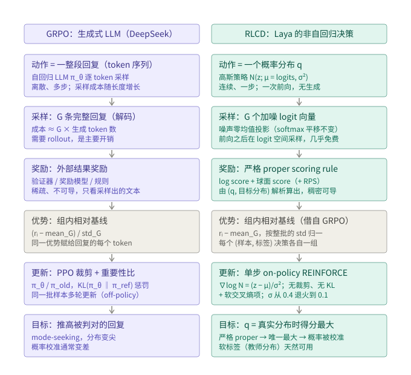

# RLCD 与 GRPO 的核心区别

Laya 的训练算法叫 **RLCD**——RL against proper scoring rules，"CD" 指 calibrated decisions。
`notebooks/laya_finetune_typed_decisions_2xT4_kaggle.ipynb` 里的训练步（`laya/multilabel/rlcd.py` 是它的函数化移植）
只有几行：

```python
# 1. 在 logit 上加 G 份高斯噪声，噪声做零均值投影（softmax 对整体平移不敏感）
eps = torch.randn((G,) + logits.shape) * sigma * mask
eps = (eps - eps.sum(-1, keepdim=True) / k) * mask
z = logits.detach().unsqueeze(0) + eps
q = torch.softmax(z.masked_fill(~mask, -1e4), -1)

# 2. 严格 proper scoring rule 做奖励，组内相对基线做优势
r = proper_reward(q, target, qtype, mask, w_sph=0.75, w_rps=1.0)   # log score + 球面 score (+ RPS)
adv = r - r.mean(0, keepdim=True)
adv = adv / (adv.std() + 1e-6)

# 3. 高斯策略的 REINFORCE + 软交叉熵
logp = -(((z - logits.unsqueeze(0)) ** 2) * mask).sum(-1) / (2 * sigma ** 2)
loss_rl = -(adv * logp).mean()
loss_ce = -(target * torch.log_softmax(logits.masked_fill(~mask, -1e4), -1)).sum(-1).mean()
loss = loss_rl + 1.0 * loss_ce
```

notebook 里的注释写着 "GRPO-style baseline"，所以常被当成"GRPO 的一个变体"。两者相同的**只有**组内相对基线这一件事；
其余每个阶段都不一样。



## 逐阶段对照

| 阶段 | GRPO（生成式 LLM） | RLCD（Laya，非自回归决策） |
|---|---|---|
| 策略 / 动作 | 自回归 LLM π_θ；动作是一整段回复（离散 token 序列，多步） | 套在模型自己 logit 上的高斯 `N(z; μ = logits, σ²)`；动作是一个概率分布 `q = softmax(z)`（连续，一步） |
| 采样 | 每个 prompt 解码 G 条完整回复；成本 ≈ G × 生成长度，是主要开销 | 一次前向之后在 logit 空间加 G 份噪声；成本是 G 次 softmax，几乎免费 |
| 奖励 | 外部结果奖励：验证器 / 奖励模型 / 规则；稀疏、不可导，只看采样出的文本 | 严格 proper scoring rule：log score + 球面 score（序数题加 RPS）；由 `(q, 目标分布)` 解析算出，稠密、可导 |
| 优势 | `(rᵢ − mean_G) / std_G`，同一优势赋给回复里的每个 token | `rᵢ − mean_G`，再按整个 batch 的 std 归一；多标签形式里每个 (样本, 标签) 决策各自一组 |
| 更新 | PPO 裁剪替代目标 + 重要性比 `π_θ / π_old` + `KL(π_θ ‖ π_ref)` 惩罚；同一批样本多轮更新 | 单步 on-policy REINFORCE，score function 就是 `(z − μ)/σ²`；无 π_old、无裁剪、无 KL、无参考模型；靠软交叉熵项和 σ 退火（0.4 → 0.1）稳定 |
| 最优解 | 推高被判对的回复；mode-seeking，分布变尖，校准通常变差 | 期望得分在 `q = 真实分布` 时唯一最大；概率本身被校准，软标签（教师分布）是合法目标 |

## 三个核心区别

**1. 优化的对象：GRPO 优化"生成什么"，RLCD 优化"报什么概率"。**
GRPO 的样本是文本，要把回复完整解码出来才能打分。RLCD 的样本是概率分布——模型前向一次得到 logits，
在 logits 上加噪声就得到 G 个不同的"报告"，没有生成、没有环境、没有多步决策。它是单步、连续动作空间的 RL。

**2. 奖励的来源，这一点决定了它为什么叫"校准决策"。**
GRPO 的奖励是对采样文本的外部判断。RLCD 的奖励是一个严格 proper scoring rule，直接对 `q` 和目标分布计算。
严格 proper 的定义：期望得分在报告的分布等于真实分布时**唯一**最大。于是最大化这个奖励等价于让模型报出校准的概率——
校准不是训练完再修的东西，而是目标函数本身。GRPO 的结果奖励没有这种性质，它只关心采样结果对不对，会把分布推尖。

**3. 优化机器。**
GRPO 是 PPO 那一套：重要性比、裁剪、KL 惩罚、参考模型、同一批样本反复更新。RLCD 只有一步 on-policy REINFORCE：
高斯策略的 score function 是 `(z − μ)/σ²`，采一次、更新一次、丢掉。没有 π_old、裁剪、KL、参考模型。

## 一个由此推出的结论

因为 RLCD 的奖励本身可导，REINFORCE 项其实在估计**高斯平滑后**的期望得分的梯度（和 evolution strategies 是同一回事）：

```
∇_μ E_ε[ r(μ + ε) ]  ≈  (1/G) Σ_i  A_i · (z_i − μ) / σ²
```

σ → 0 时，log score 那部分的梯度收敛到软交叉熵的梯度，也就是训练步里的 `loss_ce`。换句话说

```
RL 项 ≈ 交叉熵梯度 + 球面 score 的梯度 + 探索噪声
```

这解释了本目录消融里 RLCD 和纯 BCE（`rl_weight=0`）在 argmax 精度上打平：RL 项的增量在校准和软目标的匹配上，
不在"选对哪个标签"上。`tests/test_multilabel.py` 里有一项测试把 CE 关掉、只留 RL 项，概率会收敛到软标签本身
（目标 0.7 → 得到 0.70），这是严格 proper 性质的直接体现。

## 参考

- GRPO：Shao et al., *DeepSeekMath: Pushing the Limits of Mathematical Reasoning in Open Language Models*, 2024（§4.1）
- proper scoring rules：Gneiting & Raftery, *Strictly Proper Scoring Rules, Prediction, and Estimation*, JASA 2007
- RLCD 的实现：`laya/common.py: proper_reward`、`laya/multilabel/rlcd.py`、fine-tuning notebook
